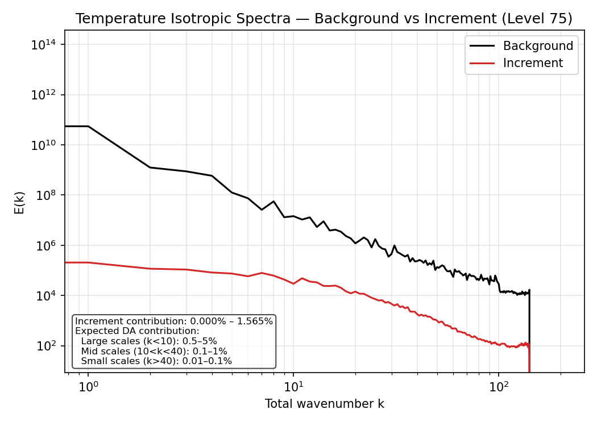
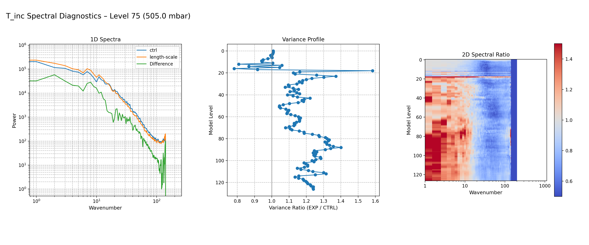
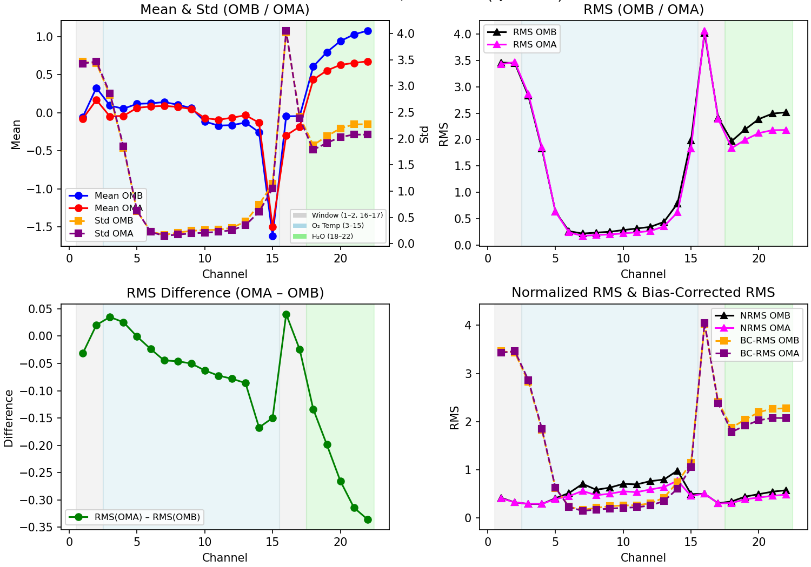

.. _diagnostics_overview:

Diagnostics Overview
====================

The diagnostics toolkit provides a unified set of tools for analyzing
background fields, increments, observation departures, and spectral
properties of the data assimilation system. In addition to the standard
diagnostic capabilities—increment maps, zonal means, observation
histograms, satellite scan‑position bias checks, and latitude‑binned
statistics—the toolkit includes two advanced diagnostic components:

1. **Power Spectral Analysis**  
   Used to quantify how variance is distributed across spatial scales
   and how experiments (e.g., NICAS length‑scale changes) modify the
   spectral characteristics of increments and background fields.

2. **Extended RMS Statistics**  
   Channel‑wise diagnostics of O–B and O–A bias, RMS, normalized RMS,
   bias‑corrected RMS, and analysis improvement metrics. These extended
   statistics provide a detailed view of observation‑space performance
   beyond simple mean and RMS values.

In addition, the toolkit supports a **chi‑square consistency check**
through automated parsing of JEDI log files. This diagnostic evaluates
whether the ratio :math:`\mathrm{Jo}/p` approaches unity, indicating
consistency between observation errors, background errors, and the
resulting analysis increments.

The following sections describe the mathematical formulation of these
diagnostics and provide example figures illustrating their use.

Spectral Diagnostics
====================

Formulation
-----------

Zonal Fourier Transform
~~~~~~~~~~~~~~~~~~~~~~~

For a field :math:`x(\lambda, \phi)` on a regular longitude grid:

.. math::

   \hat{x}_k(\phi) =
   \frac{1}{N_\lambda}
   \sum_{n=0}^{N_\lambda - 1}
   x(\lambda_n, \phi)\, e^{-i k \lambda_n}

Power Spectrum
~~~~~~~~~~~~~~

.. math::

   P(k) = \langle |\hat{x}_k(\phi)|^2 \rangle_{\phi}

**Meaning:** Distribution of variance across spatial scales.

Spectral Ratio (EXP vs CTRL)
~~~~~~~~~~~~~~~~~~~~~~~~~~~~

.. math::

   R(k) = \frac{P_{\mathrm{EXP}}(k)}{P_{\mathrm{CTRL}}(k)}

**Meaning:**  
- :math:`R(k) > 1` → EXP has more variance at scale :math:`k`  
- :math:`R(k) < 1` → EXP has less variance  

Background vs Increment Spectra
-------------------------------

   Background and increment spectra for temperature at model level 75.
   The increment spectrum shows how analysis updates redistribute
   variance across spatial scales relative to the background. Enhanced
   small‑scale variance indicates localized corrections, while reduced
   high‑wavenumber variance indicates smoother increments.

NICAS Length‑Scale Comparison
-----------------------------

The NICAS experiment modifies the static background‑error covariance by
increasing the horizontal correlation length scale specified in the
SABER NICAS operator. A larger length scale produces broader spatial
correlations and smoother increments, which appear in the spectra as
enhanced low‑wavenumber variance and reduced high‑wavenumber variance.

   Comparison of CTRL and NICAS length‑scale experiments for temperature
   increments at level 75. The NICAS experiment uses a larger horizontal
   correlation length scale in the SABER NICAS operator, broadening the
   background‑error correlations. This increases large‑scale variance
   and suppresses small‑scale variance, producing smoother increments.

Observation Statistics
======================

Formulation
-----------

Let :math:`y_i` be an observation, and let :math:`H(x_b)_i` and
:math:`H(x_a)_i` denote the background and analysis model equivalents.
Define the departures:

.. math::

   d_{b,i} = y_i - H(x_b)_i, \qquad
   d_{a,i} = y_i - H(x_a)_i.

Mean (Bias)
~~~~~~~~~~~

.. math::

   \mu(d) = \frac{1}{N} \sum_{i=1}^{N} d_i

**Meaning:** Measures systematic error. A reduction from O–B to O–A
indicates improved bias characteristics.

RMS (Root‑Mean‑Square Error)
~~~~~~~~~~~~~~~~~~~~~~~~~~~~

.. math::

   \mathrm{RMS}(d) = \sqrt{\frac{1}{N} \sum_{i=1}^{N} d_i^2}

**Meaning:** Measures total error magnitude (bias + random error).

RMS Difference (Analysis Improvement)
~~~~~~~~~~~~~~~~~~~~~~~~~~~~~~~~~~~~~

.. math::

   \Delta \mathrm{RMS} = \mathrm{RMS}(d_a) - \mathrm{RMS}(d_b)

or normalized:

.. math::

   \Delta \mathrm{RMS}_{\text{rel}} =
   \frac{\mathrm{RMS}(d_a) - \mathrm{RMS}(d_b)}{\mathrm{RMS}(d_b)}

**Meaning:** Negative values indicate analysis improvement.

Normalized RMS
~~~~~~~~~~~~~~

If observation error standard deviations :math:`\sigma_{o,i}` are available:

.. math::

   d_{n,i} = \frac{d_i}{\sigma_{o,i}}, \qquad
   \mathrm{RMS}_n = \sqrt{\frac{1}{N} \sum_{i=1}^{N} d_{n,i}^2}

**Meaning:**  
- :math:`\mathrm{RMS}_n \approx 1` → observation errors well specified  
- :math:`\mathrm{RMS}_n \gg 1` → errors underestimated  
- :math:`\mathrm{RMS}_n \ll 1` → errors overestimated  

Bias‑Corrected RMS
~~~~~~~~~~~~~~~~~~

.. math::

   \mathrm{BC\text{-}RMS}(d) =
   \sqrt{\frac{1}{N} \sum_{i=1}^{N} (d_i - \mu(d))^2}

**Meaning:** Measures random error only (bias removed).

Extended ATMS Statistics
------------------------

   Extended ATMS observation‑space diagnostics showing O–B and O–A bias,
   RMS, normalized RMS, bias‑corrected RMS, and analysis improvement
   metrics. These statistics quantify systematic error, total error,
   random error, and the degree to which the analysis reduces
   observation‑space departures.

Chi‑Square Consistency Check
============================

The chi‑square consistency diagnostic evaluates whether the innovations
(OMB) are statistically compatible with the assumed observation‑error
covariance. This test is widely used in data assimilation to assess
whether the specified observation errors are under‑ or over‑estimated.

For scalar observations with departures :math:`d_{b,i}` and
observation‑error variances :math:`\sigma_{o,i}^2`, the chi‑square
statistic is

.. math::

   \chi^2 = \frac{1}{N} \sum_{i=1}^{N}
            \frac{d_{b,i}^2}{\sigma_{o,i}^2}.

**Interpretation:**

- :math:`\chi^2 \approx 1`  
  → observation errors are consistent with the actual innovation
  statistics.

- :math:`\chi^2 \gg 1`  
  → observation errors are underestimated (innovations too large).

- :math:`\chi^2 \ll 1`  
  → observation errors are overestimated (innovations too small).

In practice, the toolkit computes this diagnostic by parsing the JEDI
log file and extracting the reported values of :math:`\mathrm{Jo}` and
the number of assimilated observations :math:`p`, using the relation

.. math::

   \chi^2 \approx \frac{\mathrm{Jo}}{p}.

A value near unity indicates that the observation‑error model is
statistically consistent with the innovations.

Reference
---------

The chi‑square consistency principle is discussed in:

- Talagrand, O. (2003). *Evaluation of probabilistic prediction systems*.
  In: **Workshop on Diagnostics for Data Assimilation Systems**, ECMWF.

This reference provides the theoretical basis for interpreting
:math:`\mathrm{Jo}/p` as a measure of observation‑error consistency.
